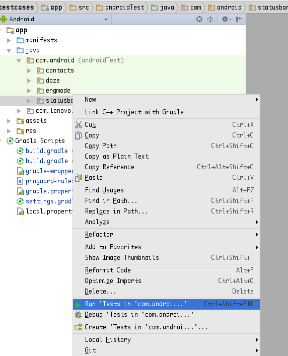
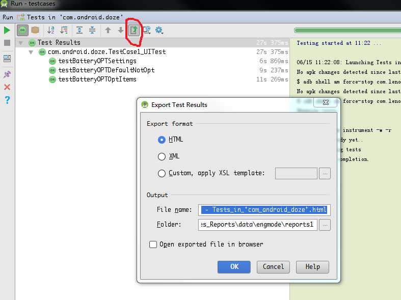

### 使用gradle生成

> 参考[官方说明链接](http://tools.android.com/tech-docs/new-build-system/user-guide#TOC-Test-reports)。

直接在代码根目录执行
```
./gradlew connectedAndroidTest --info
```
即可在app/build/reports下找到html。

### 使用Android studio生成

* 首先按照如下图示，执行需要执行的cases：



* 等待case执行完毕，选择导出测试报告即可：



### 部署github网页

> 参考[官方说明](https://pages.github.com/)

简单步骤：
* 可以先在github上fork这个项目 ```https://github.com/Lenovo-Tablet-FW/TestCases_Reports```
* 之后clone到本地，修改_post以及/data下内容，push到仓库即可。

> 或者参考[更详细的介绍](https://segmentfault.com/a/1190000000406019)